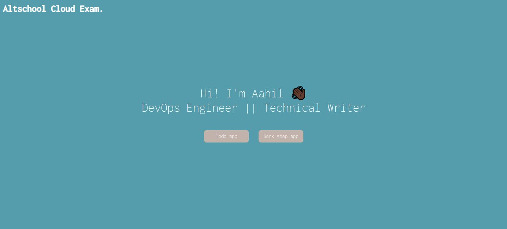

# Altschool Cloud Exam

## Overview
Deploy a microservices-based architecture on Kubernetes and create a clear IaaC (Infrastructure as Code) deployment to be able to deploy our services in a fast manner.

## How to use

This repo contains the files for two applications. The sock shop application and a personal project, the todo app.

Both folders contains files that correspond to their deployment. The following folders contain files such as:

- Github actions CI/CD pipeline
- Terraform IaC code for Eks.
- Kubernetes manifests
- Dockerfile and docker compose files
- Prometheus and grafana deployment files.

## Live link

You can use this [link]() to access both applications. Each button on the page leads to the individual project live link.

## Credits

- This project was assigned by Altschool school of Engineering. 

- The Todo application was built by [Mehul Mohan
](https://github.com/mehulmpt). 

