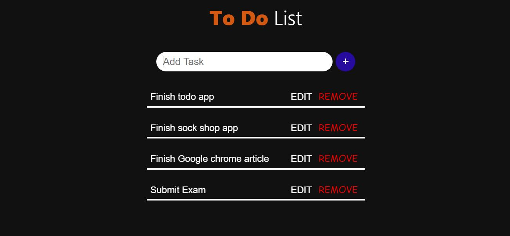

# Todo Application

## Overview

Provision a webapp of your choosing with nginx/httpd frontend proxy and a database (mongo, postgresql etc) backend .

## How to use

This is a todo list application built with `node.js`. It uses `nginx` as the frontend proxy and `mongo` as the database.

The `Dockerfile` and the `docker-compose.yml` file contains all the configurations to build the image and setup the application.

To run the application locally, follow the instructions below:

- Clone this repository
- Remove the other folder (Sock shop app) as it is another application on it's own.
- Change directory in the Todo app
    ```
        cd /Todo app
    ```
- Run the docker-compose file
    ```
        docker compose up
    ```
- This will build the image from the `Dockerfile` and start the application via `localhost`
- You can view the application here: 
    ```
        http://localhost
    ```

## Live link

This application already has it's image built and sent to dockerhub via a Github Actions CI/CD pipeline.

It has also been deployed in an `EKS` cluster on `AWS`. Hence, you can view the live project [here](http://abddbace05f4f4174946d88c3f1dd119-1470649257.us-east-1.elb.amazonaws.com/).




## Credits

- The Todo application was built by [Mehul Mohan
](https://github.com/mehulmpt). 